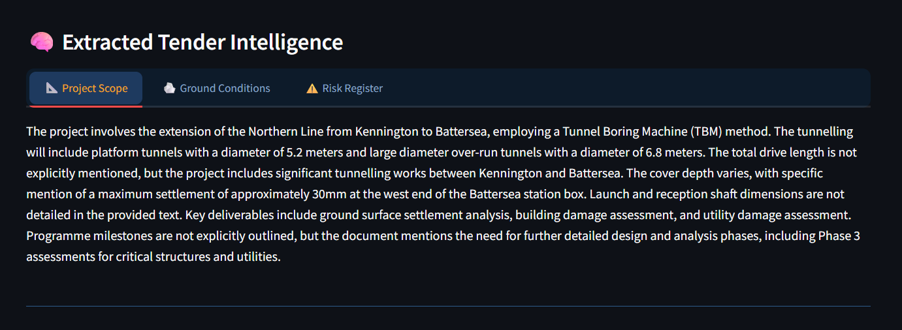
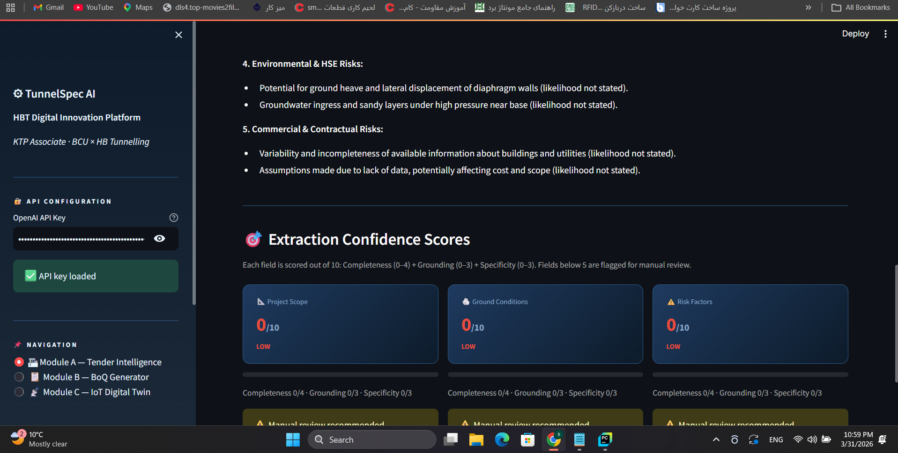
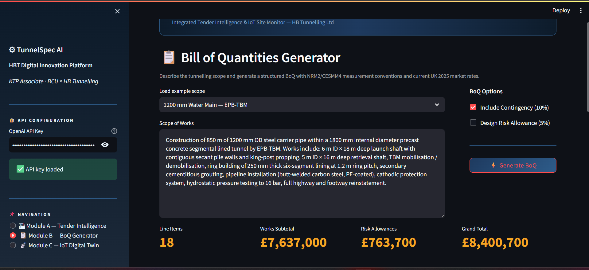
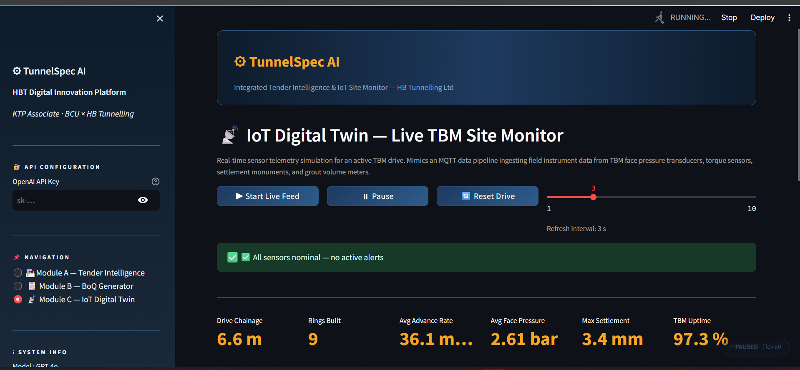

<div align="center">

# ⚙ TunnelSpec AI
### Integrated Tender Intelligence & IoT Site Monitor

**A KTP Associate Prototype — HB Tunnelling Ltd × Birmingham City University**

[](https://python.org)
[](https://streamlit.io)
[](https://openai.com)
[](https://plotly.com)
[](LICENSE)

---

> *Transforming HBT's estimating and site-monitoring workflows through applied AI — from tender PDF to live TBM dashboard.*

</div>

---

## 📸 Screenshots

<!-- ─────────────────────────────────────────────────────────────────────────
     SCREENSHOT PLACEMENT GUIDE
     Upload your screenshots to a folder called /assets/ in this repo,
     then replace the placeholder paths below with the actual filenames.
     ───────────────────────────────────────────────────────────────────── -->

### Module A — Tender Intelligence Engine
> **📌 Place screenshot here:** Upload a screenshot of the Module A page showing the extracted Project Scope, Ground Conditions, and Risk Factors tabs, plus the Opportunity Score gauge. Save it as `assets/module_a_tender.png`.



---

### Module A — Extraction Confidence Scores
> **📌 Place screenshot here:** Upload a screenshot of the three confidence score cards (Completeness / Grounding / Specificity) below the intelligence tabs. Save it as `assets/module_a_confidence.png`.



---

### Module B — Bill of Quantities Generator
> **📌 Place screenshot here:** Upload a screenshot of the generated BoQ table including the HBT Historical Benchmark column, the cost distribution pie chart, and the Export buttons. Save it as `assets/module_b_boq.png`.



---

### Module C — IoT Digital Twin (Live TBM Monitor)
> **📌 Place screenshot here:** Upload a screenshot of the live sensor dashboard with the TBM Performance charts running. Save it as `assets/module_c_iot.png`.



---

## 🧭 Project Overview

**TunnelSpec AI** is a Python-based digital innovation platform built to address three core operational challenges faced by specialist trenchless contractors:

| Challenge | TunnelSpec AI Solution |
|-----------|----------------------|
| Estimators spending days manually reading tender PDFs | **Module A** — GPT-4o extracts structured intelligence in under 60 seconds |
| Inconsistent BoQ formats across subcontractors | **Module B** — GPT-4o-generated NRM2/CESMM4-compliant schedules with historical benchmarks |
| No real-time visibility of TBM drive telemetry | **Module C** — Live IoT digital twin dashboard simulating MQTT sensor pipelines |

This prototype was developed as part of a **Knowledge Transfer Partnership (KTP)** application between **HB Tunnelling Ltd (HBT)** and **Birmingham City University (BCU)**, demonstrating the technical vision outlined in the KTP workplan.

---

## 🏗 Architecture

```
tunnelspec-ai/
│
├── app.py                  # Streamlit UI — all four modules
├── engine_ai.py            # PDF parsing, GPT-4o tender extraction, BoQ generation
├── simulator_iot.py        # TBM sensor time-series simulator
├── graph_module/           # GraphRAG layer (Module D)
│   ├── schemas.py          #   Pydantic Entity/Relation models with grounded evidence
│   ├── vector_store.py     #   Chunker + numpy cosine-similarity retrieval
│   ├── entity_extractor.py #   GPT-4o structured-output entity/relation extractor
│   ├── graph_store.py      #   GraphStore abstraction + NetworkX backend, Neo4j stub
│   ├── graph_builder.py    #   Parallel extraction + rapidfuzz dedup orchestration
│   ├── semantic_query.py   #   Cascading-risk, unmitigated-risk, dependency walks
│   └── graphrag_pipeline.py#   Side-by-side vector-RAG vs GraphRAG question answering
├── samples/                # Synthetic ITT for demoing Module D
├── tests/                  # Pytest suite for the GraphRAG module
├── requirements.txt        # Python dependencies
└── assets/                 # Screenshots for this README
```

### Data Flow

```
                    ┌──────────────────────────────────────────────────┐
                    │              TunnelSpec AI Platform              │
                    └──────────────────────────────────────────────────┘
                                            │
       ┌────────────────────┬───────────────┼───────────────┬────────────────────┐
       │                    │               │               │                    │
┌──────▼──────┐      ┌──────▼──────┐  ┌─────▼──────┐  ┌─────▼──────────┐
│  Module A   │      │  Module B   │  │  Module C  │  │   Module D     │
│  Tender     │      │  BoQ        │  │  IoT       │  │   Graph        │
│  Intelligence│     │  Generator  │  │  Digital   │  │   Reasoning    │
└──────┬──────┘      └──────┬──────┘  │  Twin      │  │   (GraphRAG)   │
       │                    │         └─────┬──────┘  └─────┬──────────┘
PDF → pypdf          Free-text scope    NumPy sim →    PDF → pypdf →
 → GPT-4o            → GPT-4o →         8 TBM sensor    chunk_text() →
   (3 RAG calls)       structured        streams →
 → Scope / Ground /    JSON BoQ with    → Plotly live   ┌──────────┴──────────┐
   Risk extraction     NRM2 rates +       charts        │                     │
 → Confidence          benchmarks       → Alert        text-embedding-3-small  GPT-4o entity
   scoring                                detection     → numpy cosine          extractor →
 → Opportunity        → CSV / Excel    → KPI            VectorStore             rapidfuzz dedup
   Score (GO/         export            dashboard            │                  → NetworkX graph
   COND / NO GO)                                             └──────────┬──────────┘
                                                                        ▼
                                                          graphrag_query() →
                                                          Vector RAG answer ‖ GraphRAG answer
                                                          + diagnostic
```

---

## 🔬 Module Deep-Dives

### Module A — Tender Intelligence Engine

Processes any construction tender PDF (ITT, Employer's Requirements, Geotechnical Interpretive Report) and returns:

- **Project Scope** — tunnelling method, diameter, drive length, shaft dimensions, programme milestones
- **Ground Conditions** — soil classification, SPT N-values, groundwater depth, mixed-face risk
- **Risk Register** — categorised under Geotechnical, Structural, Programme, Environmental, and Commercial

**Confidence Scoring** evaluates each extracted field across three dimensions:

| Dimension | Max Score | What it measures |
|-----------|-----------|-----------------|
| Completeness | 4 | Were all expected data elements present in the document? |
| Grounding | 3 | Are claims traceable to source text vs. hallucinated? |
| Specificity | 3 | Quantified figures and precise engineering terminology? |

**Opportunity Score** rates HBT's fit using a weighted rubric:

| Dimension | Weight | Description |
|-----------|--------|-------------|
| Technical Fit | 4.0 | Alignment with HBT trenchless methods and plant capability |
| Ground Suitability | 2.5 | Suitability of ground conditions for HBT's equipment |
| Risk Profile | 2.0 | Overall risk level — lower risk scores higher |
| Strategic Value | 1.5 | Geography, client relationship, market sector |

Output: **GO / CONDITIONAL GO / NO GO** recommendation with executive rationale.

---

### Module B — Bill of Quantities Generator

Converts an unstructured scope description into a fully structured BoQ using GPT-4o, applying:

- **NRM2 / CESMM4** measurement conventions
- **2025 UK market rates** for specialist trenchless works
- **HBT Historical Benchmark** column — typical past project cost ranges per item type (simulating integration with HBT's internal cost database)

Sections generated: Preliminaries · Shaft Construction · Main Tunnel Drive · Pipeline & Lining · Grouting & Ground Treatment · Utilities Diversions · Reinstatement · Risk Allowances

Built-in example scopes:
- 500 mm Gravity Sewer — Pipe Jacking (Herrenknecht AVN500)
- 1200 mm Water Main — EPB-TBM (segmental lining)
- 250 mm HDPE — HDD Railway Crossing (Network Rail interface)

**Export:** CSV and professionally formatted `.xlsx` with two sheets (BoQ + Summary).

---

### Module C — IoT Digital Twin

Simulates a live TBM sensor telemetry pipeline, mimicking what an MQTT broker would receive from field instruments on an active tunnel drive:

| Sensor | Unit | Alert Threshold |
|--------|------|----------------|
| TBM Face Pressure | bar | 3.8 bar |
| Cutterhead Torque | kN·m | 620 kN·m |
| Advance Rate | mm/min | 75 mm/min |
| Vibration (RMS) | mm/s | 3.0 mm/s |
| Water Ingress | L/min | 2.5 L/min |
| Tail Grout Pressure | bar | 3.0 bar |
| Surface Settlement | mm | 8.0 mm |
| Annulus Grout Volume | L/ring | 350 L/ring |

Each sensor stream includes: Gaussian noise · linear geological trend drift · sinusoidal stratigraphy variation · 2% probability operational spike events.

**KPI Dashboard:** Drive Chainage · Rings Built · Average Advance Rate · Average Face Pressure · Max Settlement · TBM Uptime %

**Sensor Correlation Matrix** (All Sensors tab) identifies cross-sensor dependencies in real time.

---

### Module D — Graph Reasoning (GraphRAG)

A knowledge-graph + semantic-reasoning layer sitting **alongside** the existing extraction pipeline. Module D demonstrates that not every tender question is best served by vector retrieval — some require connecting facts across sections, and that's what a graph traversal can do that nearest-neighbour search cannot.

#### Why graph reasoning complements vector RAG

A worked example from the bundled sample document:

> *"What downstream commercial impact could a groundwater ingress event ultimately cause?"*

The full causal chain — `Risk_Groundwater_Ingress → TRIGGERS → Risk_TBM_Stoppage → TRIGGERS → Risk_Programme_Delay → TRIGGERS → Risk_Cost_Overrun` — is **deliberately split across four separate sections** of the ITT (Geotechnical Risk, Programme Risk, Operational Risk, Commercial Risk). A vector retriever pulling top-k chunks for the question gets the groundwater section and possibly the cost section, but rarely retrieves all four intermediate links in a single shot. Graph traversal follows `TRIGGERS` edges and recovers the chain regardless of where each link was authored. The Streamlit panel surfaces both answers side-by-side and prints a diagnostic ("seeded traversal from Risk_Groundwater_Ingress; 4 additional entities reached via 5 relations") so the difference is visible, not asserted.

#### Entity / relation taxonomy

| Entity types | Relation types |
|---|---|
| `Project`, `Risk`, `Mitigation`, `Phase`, `Stakeholder`, `Material`, `Specification`, `Cost_Item`, `Constraint`, `Location` | `AFFECTS`, `MITIGATES`, `DEPENDS_ON`, `REQUIRES`, `RESPONSIBLE_FOR`, `TRIGGERS`, `RELATED_TO`, `PART_OF` |

Every extracted relation carries an `evidence_span` (verbatim snippet from the source) and a `confidence ∈ [0, 1]`. This mirrors the project's existing 3-D confidence rubric — claims must be grounded in the document, not asserted.

#### Three demo queries

| Query | What it does | Example output |
|---|---|---|
| `find_cascading_risks(graph, root, max_hops=3)` | BFS along `TRIGGERS` / `RELATED_TO` edges from a root risk; returns each downstream risk plus the path taken. | `Risk_Cost_Overrun` reached from `Risk_Groundwater_Ingress` in 3 hops via `[TRIGGERS, TRIGGERS, TRIGGERS]`. |
| `find_unmitigated_risks(graph)` | Returns every `Risk` node with no incoming `MITIGATES` edge. | On the sample ITT: `Risk_Third_Party_Building_Damage` — flagged because Section 6 explicitly leaves it for tenderers to price. |
| `find_critical_dependencies(graph, phase)` | Returns upstream phase prerequisites plus required `Material` and `Specification` nodes. | For `Phase_Tunnel_Drive`: depends on `Phase_Launch_Shaft`; requires `Material_EPB_TBM`, `Material_Precast_Concrete_Segments`, `Spec_Drive_Length_1200m`. |

#### Architecture

```
PDF upload
    │
    ▼
pypdf → full text ─┬───────────────────────────────────────────────┐
                   │                                               │
                   ▼                                               ▼
           chunk_text()                                    chunk_text()
                   │                                               │
                   ▼                                               ▼
        text-embedding-3-small                  GPT-4o entity extractor (parallel chunks)
                   │                                               │
                   ▼                                               ▼
            VectorStore                          rapidfuzz dedup ─► NetworkXGraphStore
            (numpy + cosine)                                       (MultiDiGraph)
                   │                                               │
                   └────────────────┬──────────────────────────────┘
                                    ▼
                 graphrag_query(): same chunks, same model, same prompt shape
                                    │
                  ┌─────────────────┴──────────────────┐
                  ▼                                    ▼
          Vector RAG answer                    GraphRAG answer
                                    + diagnostic ("why they differ")
```

Backend uses NetworkX for portability; production target is Neo4j (interface defined in `graph_module/graph_store.py` as `Neo4jGraphStore`).

#### How to demo

A synthetic ITT with a deliberate cascading-risk structure ships in `samples/`:

```bash
streamlit run app.py
# 1. Sidebar → enter your OpenAI API key
# 2. Sidebar → select "Module D — Graph Reasoning"
# 3. Upload  samples/riverside_trunk_sewer_ITT.pdf
# 4. Click "Build Knowledge Graph + Vector Index" (~30-60 s)
# 5. Inspect the pyvis graph (colour-coded by entity type), then
#    run the side-by-side query — the default question is the
#    cross-section cascade case described above.
```

To regenerate the sample PDF: `python samples/generate_sample_pdf.py` (requires `reportlab`, dev-only — not in `requirements.txt`).

#### Tests

```bash
pytest tests/test_graph_module.py -v
```

Covers: Pydantic schema validation, alias dedup via rapidfuzz, multi-hop BFS path correctness, `find_unmitigated_risks` exclusion logic, dependency partitioning by entity type, and the full `graphrag_query` flow with mocked OpenAI.

---

## 🚀 Getting Started

### Prerequisites

- Python 3.10 or higher
- An OpenAI API key ([platform.openai.com](https://platform.openai.com)) — required for Modules A & B only
- Module C runs fully offline with no API key

### Installation

```bash
# 1. Clone the repository
git clone https://github.com/Soheil-jafari/tunnelspec-ai-.git
cd tunnelspec-ai-

# 2. Create and activate a virtual environment (recommended)
python -m venv .venv

# Windows
.venv\Scripts\activate

# macOS / Linux
source .venv/bin/activate

# 3. Install dependencies
pip install -r requirements.txt

# 4. Launch the app
streamlit run app.py
```

The app will open automatically at `http://localhost:8501`.

### Configuration

No `.env` file or config needed. Enter your OpenAI API key directly in the sidebar when the app loads.

---

## 📦 Dependencies

| Package | Purpose |
|---------|---------|
| `streamlit` | Web UI framework |
| `openai` | GPT-4o API client |
| `pypdf` | PDF text extraction |
| `pandas` | Data manipulation and BoQ structuring |
| `numpy` | Sensor time-series simulation |
| `plotly` | Interactive charts and live dashboards |
| `openpyxl` | Excel (.xlsx) export |
| `networkx` | In-memory knowledge graph (Module D) |
| `pyvis` | Interactive graph visualisation (Module D) |
| `rapidfuzz` | Entity-name fuzzy deduplication (Module D) |

---

## 🗺 Technical Roadmap

The current build establishes the foundation; the planned next-phase upgrades extend each module along its natural research axis.

### Mamba-SSM for Long-Horizon IoT Monitoring

The IoT module currently uses NumPy simulation. The intended production architecture replaces that with **Mamba (Selective State Space Models)** for real sensor sequence modelling — the right primitive for a TBM drive that may run for many months at high sampling rates:

| Aspect | Transformer (Attention) | Mamba-SSM |
|--------|------------------------|-----------|
| Time complexity | O(n²) — quadratic | O(n) — linear |
| Memory scaling | Memory wall at long sequences | Constant memory footprint |
| Long-horizon telemetry | Requires aggressive chunking | Full sequence, no truncation |
| Edge deployment | High compute cost | Hardware-aware recurrence, GPU/edge optimised |

**Target outcome:** Predictive anomaly detection 60–90 seconds ahead of threshold breach — giving TBM operators intervention time before a ground loss or structural event.

### Feature Pipeline

- [ ] Live MQTT broker integration (Eclipse Mosquitto / AWS IoT Core)
- [ ] Mamba-SSM anomaly prediction model trained on historical TBM drive data
- [ ] Automated tender shortlisting from procurement portal APIs
- [ ] Multi-project portfolio dashboard (concurrent drive monitoring)
- [ ] RAG over an internal cost database for live benchmark pricing
- [ ] BIM/GIS integration for alignment and geology visualisation
- [ ] Neo4j backend for the GraphRAG module (interface already defined in `graph_module/graph_store.py`)

---

## 👤 Author

**Soheil Jafari**
AI Engineer | MSc [Your Degree] | BEng Electrical Engineering

KTP Associate Candidate — HB Tunnelling Ltd × Birmingham City University

[](https://github.com/Soheil-jafari)

---

## 📄 License

This project is licensed under the MIT License.

---

<div align="center">

*Built to demonstrate the technical vision for the HBT-BCU Knowledge Transfer Partnership.*
*Trenchless · Pipe Jacking · Micro-tunnelling · EPB-TBM · HDD*

</div>
